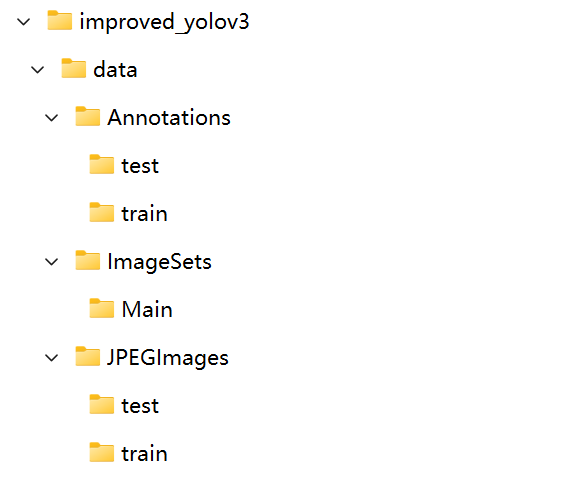

# Improved-Yolo3
Tiny Object Detection Using Improved Yolo3 from Seagull Datase
## Background

## Environment
**python>=3.8 is required**  

**torch-gpu for windows:**   
``$ pip3 install torch torchvision torchaudio --extra-index-url https://download.pytorch.org/whl/cu113``

**other requirements**  
``$ pip install -r requirements.txt ``

## Data preparing
1. The seagull dataset could be downloaded from **[this link](https://drive.google.com/file/d/1zzivc2h6sSw3ftZ-wPU7jH9DaOLKETEL/view?usp=sharing)**

2. The organize directories is shown below:  

3. run parse_voc_xml.py file to generate **train.txt** and **val.txt** using command:  
``$  python parse_voc_xml.py ``

## Train
1. You could go through config.py file to config parameter before training  

2. After config, you could train using command:  
``$  python train.py ``

## Test single image

## Evaluate
